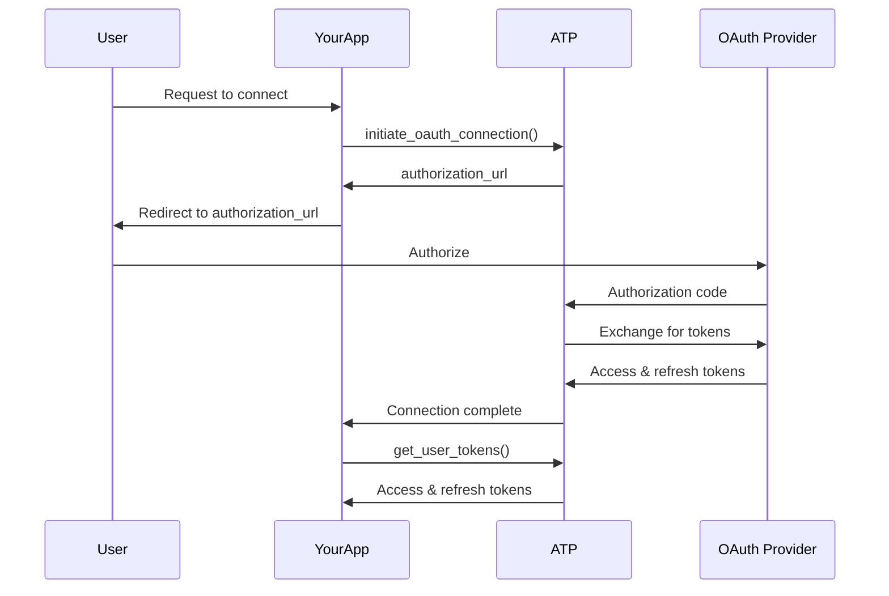

## Overview

The ATP SDK supports secure OAuth2 flows for tools that require third-party authentication (e.g., HubSpot, Google, Salesforce). This guide covers:

- How OAuth2 works in ATP
- Setting up OAuth2 for your tools
- Managing user tokens
- Supported OAuth2 providers

---

## How OAuth2 Works in ATP



1. **Initiate OAuth**: Your app calls `initiate_oauth_connection()` to start the OAuth flow.
2. **User Authorization**: The user is redirected to the OAuth provider to authorize.
3. **Token Exchange**: ATP exchanges the authorization code for access and refresh tokens.
4. **Token Storage**: ATP stores the tokens securely.
5. **Token Injection**: ATP automatically injects tokens into tool calls as needed.

---

## Setting Up OAuth2 for Your Tools

### Step 1: Register a Tool with OAuth2

When registering a tool, specify the OAuth2 provider and authentication details:

```python
from atp_sdk.clients import ToolKitClient
import requests

client = ToolKitClient(
    api_key="YOUR_ATP_API_KEY",
    app_name="my_toolkit"
)

@client.register_tool(
    function_name="get_contacts",
    params=[],
    required_params=[],
    description="Fetches contacts from HubSpot.",
    auth_provider="hubspot",      # OAuth2 provider
    auth_type="OAuth2",            # Authentication type
    auth_with="access_token"       # Token parameter name
)
def get_contacts(**kwargs):
    # ATP automatically injects the access token
    access_token = kwargs.get('auth_token')
    
    url = "https://api.hubapi.com/crm/v3/objects/contacts"
    headers = {"Authorization": f"Bearer {access_token}"}
    response = requests.get(url, headers=headers)
    return response.json()

client.start()
```

### Step 2: Initiate OAuth Connection

Use the `LLMClient` to initiate the OAuth flow:

```python
from atp_sdk.clients import LLMClient

llm_client = LLMClient(api_key="YOUR_ATP_API_KEY")

# Initiate OAuth connection
connection = llm_client.initiate_oauth_connection(
    platform_id="hubspot",
    external_user_id="user@example.com",
    developer_redirect_url="https://your-app.com/oauth/callback"
)

# Get the authorization URL
auth_url = connection["authorization_url"]
print(f"Authorize at: {auth_url}")
```

### Step 3: Wait for Connection

Poll for OAuth connection completion:

```python
# Wait for the user to authorize
account = llm_client.wait_for_connection(
    platform_id="hubspot",
    external_user_id="user@example.com"
)

print(f"Integration ID: {account['integration_id']}")
```

### Step 4: Fetch Tokens (Optional)

If you need to access the tokens directly:

```python
tokens = llm_client.get_user_tokens(
    platform_id="hubspot",
    external_user_id="user@example.com"
)

print(f"Access token: {tokens['access_token']}")
print(f"Refresh token: {tokens['refresh_token']}")
```

<Note>
  You don't need to manually inject tokens into tool calls. ATP will automatically inject the `auth_token` into your function's `kwargs` when a user has authenticated.
</Note>

---

## Supported OAuth2 Providers

ATP supports the following OAuth2 providers:

<CardGroup cols={2}>
  <Card title="HubSpot" icon="hubspot">
    CRM, Marketing, and Sales automation
  </Card>
  <Card title="Google" icon="google">
    Gmail, Calendar, Drive, and more
  </Card>
  <Card title="Salesforce" icon="salesforce">
    CRM and customer success platform
  </Card>
  <Card title="Microsoft" icon="microsoft">
    Outlook, Teams, OneDrive, and more
  </Card>
</CardGroup>

<Info>
  Need support for another OAuth2 provider? [Contact us](mailto:support@chat-atp.com) or [open an issue](https://github.com/sam-14uel/Agent-Tool-Protocol/issues).
</Info>

---

## Complete Example

Here's a complete example that demonstrates the OAuth2 flow:

```python
from atp_sdk.clients import ToolKitClient, LLMClient
import requests

# Initialize clients
toolkit_client = ToolKitClient(
    api_key="YOUR_ATP_API_KEY",
    app_name="hubspot_toolkit"
)

llm_client = LLMClient(api_key="YOUR_ATP_API_KEY")

# Register a tool with OAuth2
@toolkit_client.register_tool(
    function_name="create_company",
    params=['name', 'domain', 'industry'],
    required_params=['name', 'domain', 'industry'],
    description="Creates a company in HubSpot.",
    auth_provider="hubspot",
    auth_type="OAuth2",
    auth_with="access_token"
)
def create_company(**kwargs):
    access_token = kwargs.get('auth_token')
    url = "https://api.hubapi.com/crm/v3/objects/companies"
    headers = {
        "Authorization": f"Bearer {access_token}",
        "Content-Type": "application/json"
    }
    data = {
        "properties": {
            "name": kwargs.get('name'),
            "domain": kwargs.get('domain'),
            "industry": kwargs.get('industry')
        }
    }
    response = requests.post(url, json=data, headers=headers)
    return response.json()

# Initiate OAuth connection
connection = llm_client.initiate_oauth_connection(
    platform_id="hubspot",
    external_user_id="user@example.com",
    developer_redirect_url="https://your-app.com/oauth/callback"
)

print(f"Authorize at: {connection['authorization_url']}")

# Wait for connection
account = llm_client.wait_for_connection(
    platform_id="hubspot",
    external_user_id="user@example.com"
)

print(f"Integration ID: {account['integration_id']}")

# Start the toolkit
toolkit_client.start()
```

---

## API Key Authentication

For services that use API keys instead of OAuth2, you can use the `apiKey` auth type:

```python
@client.register_tool(
    function_name="get_data",
    params=[],
    required_params=[],
    description="Fetches data using an API key.",
    auth_provider="my_service",
    auth_type="apiKey",
    auth_with="api_key"
)
def get_data(**kwargs):
    api_key = kwargs.get('auth_token')
    # Use the API key to make requests
    ...
```

---

## Token Refresh

ATP automatically handles token refresh for OAuth2 providers. When an access token expires, ATP will:

1. Use the refresh token to get a new access token
2. Update the stored tokens
3. Retry the tool call with the new access token

You don't need to handle token refresh manually.

---

## Security Best Practices

<Warning>
  Never hardcode API keys or access tokens in your code. Always use environment variables or secure storage.
</Warning>

1. **Use HTTPS**: Always use HTTPS for your redirect URLs.
2. **Validate Tokens**: ATP validates tokens before injecting them into tool calls.
3. **Secure Storage**: ATP stores tokens securely on the server.
4. **Token Expiration**: ATP automatically refreshes expired tokens.

---

## Next Steps

<CardGroup cols={2}>
  <Card title="ToolKitClient" icon="wrench" href="/sdk/toolkit-client">
    Learn how to register and serve tools
  </Card>
  <Card title="LLMClient" icon="robot" href="/sdk/llm-client">
    Connect LLMs to your toolkits
  </Card>
  <Card title="Examples" icon="lightbulb" href="/examples/overview">
    Explore OAuth2 examples
  </Card>
  <Card title="Framework Integration" icon="code" href="/integrations/overview">
    Use ATP with Django, FastAPI, or Flask
  </Card>
</CardGroup>
